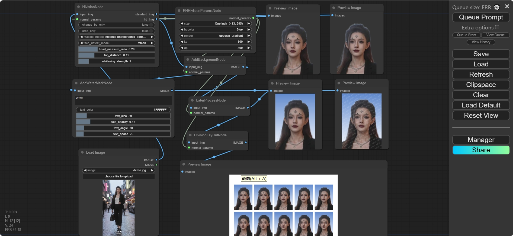

# HivisionIDPhotos-ComfyUI
a custom node for [HivisionIDPhotos](https://github.com/Zeyi-Lin/HivisionIDPhotos), you can find [证件照_workflow](./doc/证件照_workflow.json),or [id_photo_workflow](./doc/id_photo_workflow.json)

## Example
| 输入 | 抠图 | 换背景 | 加水印 | 排版 |
| -- | -- | -- | -- | -- |
|  [source](https://www.liblib.art/imageinfo/b7cb6b18b2af4c37be8607b648b52979) |   |  | | |

## 教程
- [Demo](https://www.bilibili.com/video/BV1iFpvegEY3/)
- [一键包](https://pan.quark.cn/s/b8422210f61a)

# 🤩 最近更新
- 2024.9.13 增加**美白**功能

## weights
存到项目的`ComfyUI/custom_nodes/HivisionIDPhotos-ComfyUI/hivision/creator/weights`目录下：
- `modnet_photographic_portrait_matting.onnx` (24.7MB): [MODNet](https://github.com/ZHKKKe/MODNet)官方权重，[下载](https://github.com/Zeyi-Lin/HivisionIDPhotos/releases/download/pretrained-model/modnet_photographic_portrait_matting.onnx)
- `hivision_modnet.onnx` (24.7MB): 对纯色换底适配性更好的抠图模型，[下载](https://github.com/Zeyi-Lin/HivisionIDPhotos/releases/download/pretrained-model/hivision_modnet.onnx)
- `rmbg-1.4.onnx` (176.2MB): [BRIA AI](https://huggingface.co/briaai/RMBG-1.4) 开源的抠图模型，[下载](https://huggingface.co/briaai/RMBG-1.4/resolve/main/onnx/model.onnx?download=true)后重命名为`rmbg-1.4.onnx`
- `birefnet-v1-lite.onnx`(224MB): [ZhengPeng7](https://github.com/ZhengPeng7/BiRefNet) 开源的抠图模型，[下载](https://github.com/ZhengPeng7/BiRefNet/releases/download/v1/BiRefNet-general-bb_swin_v1_tiny-epoch_232.onnx)后重命名为`birefnet-v1-lite.onnx`

- RetinaFace | **离线**人脸检测模型，CPU推理速度中等（秒级），精度较高| [下载](https://github.com/Zeyi-Lin/HivisionIDPhotos/releases/download/pretrained-model/retinaface-resnet50.onnx)后放到`hivision/creator/retinaface/weights`目录下